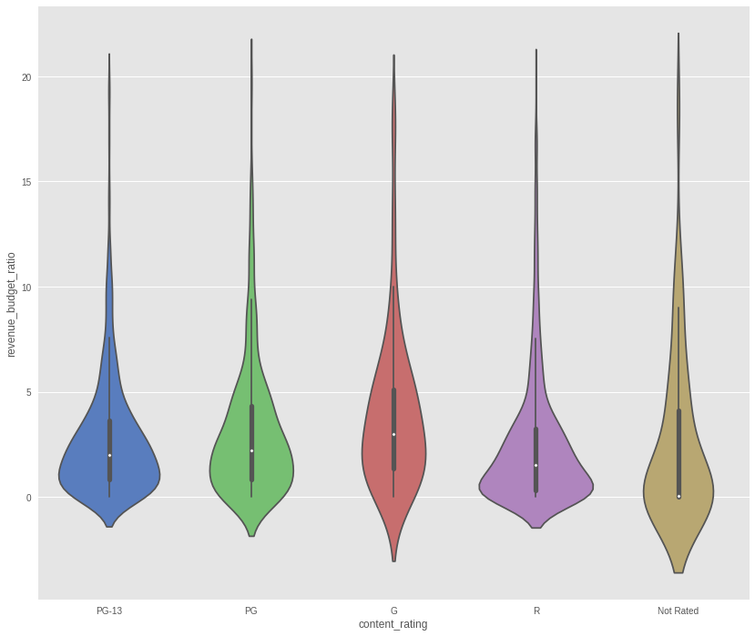
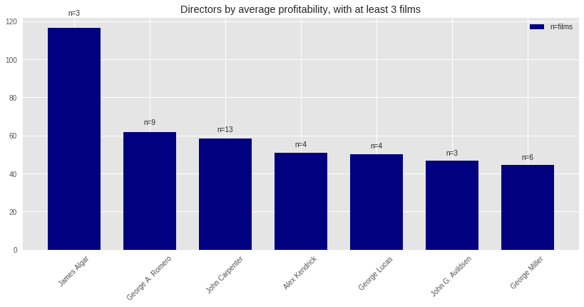
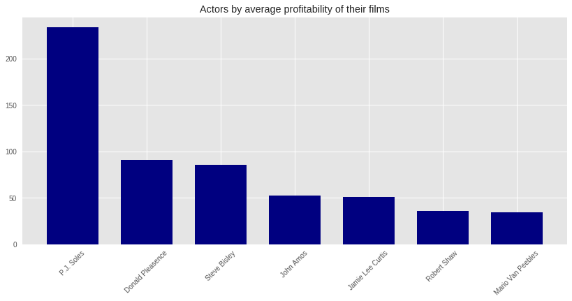
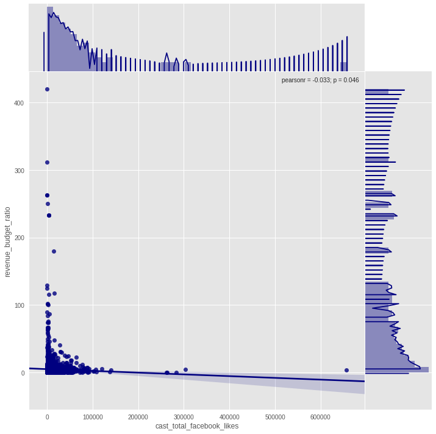
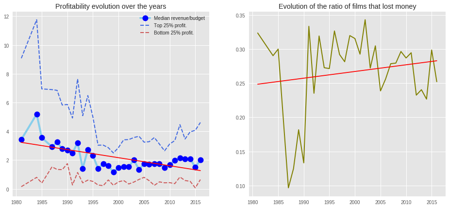
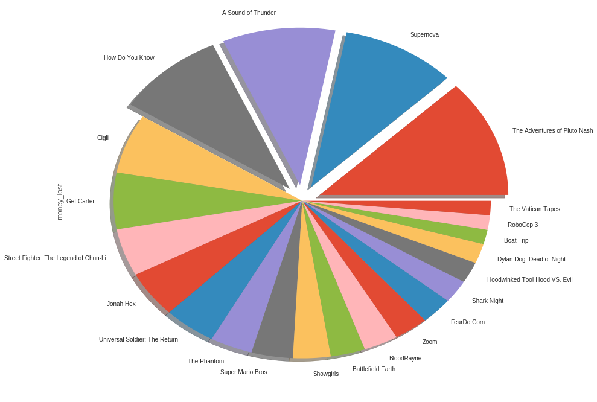
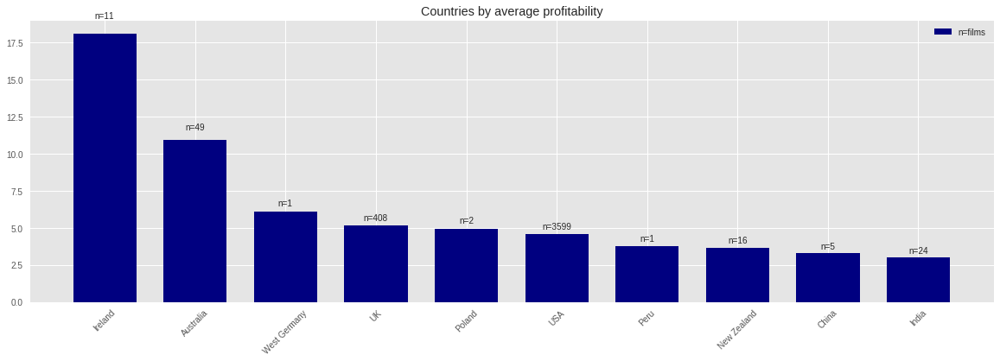
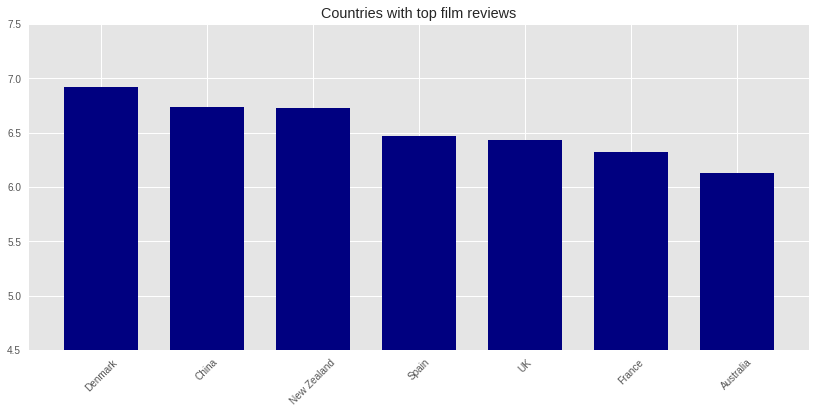
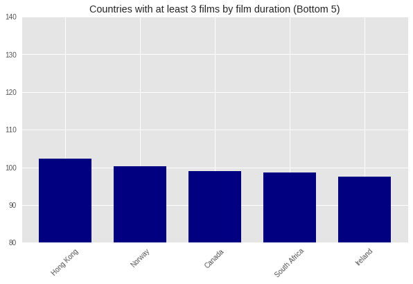

IMDB EDA
==============================

Exploratory Data Analysis of two public IMDB movie databases

Project Organization
------------

    ├── LICENSE
    ├── README.md
    ├── data
    ├── notebooks
    ├── reports
    │   └── figures 
    └── src

--------
## Introduction

I will explore some possibilities of Python Exploratory Data Analysis capabilities with a couple of IMDB movies databases. The goal of this research will be also to analyze how some of the film features behave in relation to film total revenues and profitability.

## Data

Data is split among two files, both taken from Kaggle repositories:

* [tmdb_5000_movies.csv](https://www.kaggle.com/tmdb/tmdb-movie-metadata/data): General movie info without actors data for around 5k films.
* [movie_metadata.csv](https://www.kaggle.com/suchitgupta60/imdb-data/data): alternative info about broadly the same 5k films, more focused on Facebook likes and other social media data of directors and cast.

The data has been cleaned (repeated features, data extraction from certain columns and feature engineering in general) in order to be able to operate with a single dataframe from which create the visualizations needed to achieve the project goals.

## Project Goals

### What makes gross revenue increase? How are these variables related to each other?

Among the different correlations studied, it's interesting to see just how important is budget for the films final revenue, as one could expect:

But there are also other important features with a decisive rol in revenue less evident. For one, we can see how longer films have also a strong correlation towards bigger revenues:

What is even less expected is that the number of faces in the poster correlates negatively with the films revenues, with a p under 3% that is just too low to discard:

Finally, it's interesting to see how different film genres have different profitability (revenue to budget ratio) distributions, with R rated films clearly being much more concentrated towards lower profitability figures.

### What actors and directors have the highest budget to gross ratio?

Next there is a graph showing the top 7 directors by profitability ratio. There is a clear winner with James Algar, but it's interesting to see popular names like George Lucas in the top 7:

As we've done with the directors, it's also important to review which actors have the highest profitability ratios, in case someone is interested in hiring:

Finally, the strange point in this section was clearly provided by the relation between the total number of Facebook likes of the films cast and the films profitability, that showed to be negative, with a p under 5%:

### What movies where the biggest flops? Are there factors that are associated with flops?

To analyze the biggest flops, it's important to review first the evolution of the profitability throughout the years, inspecting the ratio of films that lost money at the same time:

We can see how, although the number of films that lost money remain somewhat constant, the median profitability has a clear down slope and has remained since the year 2000 under 2.

We can see now inspect the biggest flops. For that, we will filter films that:

* Had a budget lower than revenue
* Have a IMDB score under 5 and at least 100 votes, to avoid independent movies and those acclaimed by the critic.
* Sort by the total amount of money they lost

### What countries make the most profitable and valued films?

We can also find some interesting pooints in the comparison among countries. First, we can see which countries make the most profitable films:

And also which countries make the most acclaimed movies:

Also, which countries make the shortest films?

Couriously, Irland makes at the same time the shortest films and the highest profitable ones! This, although we saw earlier that the film runtime correlates positively with its revenue.
